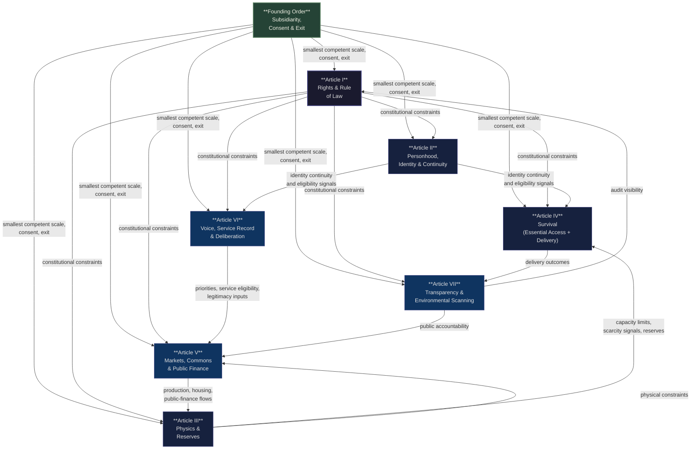

# The Humane Constitution

**Constitution for a Humane Civilization**  
*A Charter of Human Dignity, Stewardship, and Non-Coercive Order*

> A constitutional design for separating survival, markets, and civic power so wealth cannot quietly become coercion.

## Contents

- [What this is](#what-this-is)
- [Current status](#current-status)
- [If you're skeptical](#if-youre-skeptical)
- [The core separation](#the-core-separation)
- [The current architecture](#the-current-architecture)
- [Architecture flow](#architecture-flow)
- [Document set](#document-set)
- [Technical specifications](#technical-specifications)
- [Hardening history](#hardening-history)
- [Security and attack surface](#security-and-attack-surface)
- [What this system is not](#what-this-system-is-not)
- [What will go wrong](#what-will-go-wrong-pre-committed)
- [Scale readiness checklist](#scale-readiness-checklist)
- [How to engage](#how-to-engage)
- [License](#license)

## What this is

The Humane Constitution is a constitutional systems design for a society where baseline survival is protected, markets remain productive, and civic power cannot be bought. It is built on a single core diagnosis: when survival, enterprise, and political influence all ride on the same money, wealth converts into coercion. This constitutional project is an attempt to escape that failure mode by design.

This is not a live government, a finished rollout plan, or a promise that the hard parts are already solved. It is a public constitutional design backed by systems engineering: threat modeling, adversarial red-teaming, patch logs, validation checks, and version control.

## Current status

This project is strongest today as a design, critique target, and public working draft. It is **not scale-ready**.

What exists now:

- constitutional text and public explanations
- a threat register and patch log
- adversarial simulations and stress-test documents
- a validation pipeline and reader app

What must still be proven:

- pilot evidence at real scale
- a non-coercive identity and recovery stack
- reliable measurement of essential capacity
- a legitimate founding coalition

The right response is neither blind belief nor dismissal. The useful response is specific critique, hard testing, and evidence.

## If you're skeptical

Start with [`docs/Public_Readiness_Guide.md`](./docs/Public_Readiness_Guide.md). It states what the project claims, what is only designed, what still needs evidence, and which objections deserve the most pressure.

## If you're new

Use this reading order:

1. [`docs/One_Page_Overview.md`](./docs/One_Page_Overview.md) for the shortest public introduction
2. [`docs/Public_Readiness_Guide.md`](./docs/Public_Readiness_Guide.md) for the claims, readiness status, and strongest objections
3. [`White_Paper.md`](./White_Paper.md) for the fuller public explanation
4. [`Citizen_Facing_Rights_Layer.md`](./Citizen_Facing_Rights_Layer.md) for the plain-language rights summary
5. [`Humane_Constitution.md`](./Humane_Constitution.md) for the governing text
6. [`Threat_Register.md`](./Threat_Register.md) if you want to test the design against failure and bad actors

## The core separation

The protocol separates three social functions across five instruments that most systems collapse together:

| Instrument | Purpose | What it cannot do |
|---|---|---|
| **Flow** | Markets, wages, contracts, savings, investment | Buy survival access or civic power |
| **Essential Access** | Survival floor and baseline essentials: food, water, shelter, healthcare, essential medicines, and basic transit | Become cash, collateral, or a status marker |
| **Voice** | Bounded agenda-setting and budget prioritization | Buy rights, goods, or survival access |
| **Service Record** | Eligibility for rotating public-service roles and stewardship history | Measure human worth or accumulate permanent rank |
| **Shared Storehouse** | Emergency rationing during verified shortage | Become permanent or a hidden market |

The walls between these lanes are the system. Not the instruments themselves.

Essential Access protects the survival floor. Voice shapes bounded civic priorities. Service Record governs readiness for rotating public roles. Shared Storehouse appears only during verified shortage.

Flow is public money rather than privately created bank money. It is primarily digital, secured with cryptographic methods, and paired with physical cash or equivalent offline instruments for resilience and privacy.

## The current architecture

The live constitutional presentation uses **one Founding Order** and **seven Articles of Constitutional Order**.

- **Founding Order — Subsidiarity, Consent & Exit** — The constitutional foundation: smallest-competent scale by default, affirmative consent to join, and graceful exit without forfeiture.
- **Article I — Rights & Rule of Law** — Tier 1 invariants, due process, non-coercion, and rule-bound execution.
- **Article II — Personhood, Identity & Continuity** — One-person continuity, recovery, guardianship, and dependent protection without surveillance scoring.
- **Article III — Physics & Reserves** — Polycentric measurement of real capacity plus the reserves that buffer shocks and measurement error.
- **Article IV — Survival** — Essential Access as the survival instrument and delivery lane for baseline essentials.
- **Article V — Markets, Commons & Public Finance** — Flow, housing and land use-rights, enterprise, public banking rails, and commons revenue under one economic surface.
- **Article VI — Voice, Service Record & Deliberation** — Voice for bounded prioritization, Service Record for public-service eligibility, and the contribution system that feeds them.
- **Article VII — Transparency & Environmental Scanning** — Public dashboards, independent audit visibility, and external-world scanning.

## Architecture flow

The diagram below shows how the current Founding Order and Articles I-VII relate internally.

**Reading the diagram:** The **Founding Order** establishes scale, consent, and exit defaults across the entire architecture. **Article I** constrains every operational article constitutionally. The instrument-level non-convertibility rules are enforced within the architecture itself rather than by a separate sovereign body.

## Document set

### Public release docs

| Document | Purpose |
|---|---|
| [`docs/One_Page_Overview.md`](./docs/One_Page_Overview.md) | One-page introduction for first-time readers. |
| [`docs/Public_Readiness_Guide.md`](./docs/Public_Readiness_Guide.md) | Skeptic reading path, claims audit, readiness dashboard, and evidence map. |
| [`docs/Public_FAQ.md`](./docs/Public_FAQ.md) | Public-facing answers to the most common objections and questions. |
| [`docs/Source_Grounded_Content_Prompts.md`](./docs/Source_Grounded_Content_Prompts.md) | Reusable prompt pack for source-grounded explainers, interviews, FAQs, and short-form content. |
| [`docs/content/Visual_Assets.md`](./docs/content/Visual_Assets.md) | Index of reusable public deck assets and social carousel files. |
| [`docs/content/First_60_Second_Explainer.md`](./docs/content/First_60_Second_Explainer.md) | First short explainer script for video or voiceover. |
| [`docs/content/Three_Minute_Explainer.md`](./docs/content/Three_Minute_Explainer.md) | Longer explainer script for a first serious introduction. |
| [`docs/content/Short_Form_Hooks.md`](./docs/content/Short_Form_Hooks.md) | Ten short-form hooks for social video. |
| [`docs/content/FAQ_Video_Set.md`](./docs/content/FAQ_Video_Set.md) | Short video answers to common public objections. |
| [`docs/content/Skeptical_Audience_Rebuttal.md`](./docs/content/Skeptical_Audience_Rebuttal.md) | Rebuttal script for audiences worried about socialism, bureaucracy, or social credit. |
| [`docs/content/Podcast_Interview_Pack.md`](./docs/content/Podcast_Interview_Pack.md) | Interview questions and source-grounded model answers. |
| [`White_Paper.md`](./White_Paper.md) | Plain-language public explanation. |
| [`Citizen_Facing_Rights_Layer.md`](./Citizen_Facing_Rights_Layer.md) | Plain-language summary of citizen rights and protections. |

### Core documents

| Document | Purpose |
|---|---|
| [`Humane_Constitution.md`](./Humane_Constitution.md) | Primary constitutional source of truth. Lean constitutional text with links into the standalone annex corpus. |
| [`Threat_Register.md`](./Threat_Register.md) | Adversarial risk model. 27 threat IDs — 17 ADDRESSED, 5 PARTIAL, 4 OPEN (T-003 retired). T-017/P-014 is the FOUNDING instrument. |
| [`Patch_Log.md`](./Patch_Log.md) | Change and mitigation history. 31 patches — 16 ACTIVE, 15 PROPOSED (1 FOUNDING: P-014). |
| [`Acceptance_Protocol.md`](./Acceptance_Protocol.md) | Process for moving patches from design to operation. |

## Technical Specifications

| Document | Purpose |
|---|---|
| [`docs/INVARIANTS.md`](./docs/INVARIANTS.md) | Seven constitutional invariants (INV-001 through INV-007). Tier 1 protected. Any patch that violates these is rejected at intake. |
| [`docs/SPECIFICATIONS.md`](./docs/SPECIFICATIONS.md) | Formal state machine definitions for Flow, Essential Access, Voice, Service Record, and Shared Storehouse. Demurrage function, issuance constraints, oracle consensus rules, and parameter tables. |
| [`docs/Adversarial_Narrative_Simulation.md`](./docs/Adversarial_Narrative_Simulation.md) | 10 simulated narrative attacks with structural responses and residual risks. |
| [`docs/Annual_Compound_Simulation.md`](./docs/Annual_Compound_Simulation.md) | Month-by-month operational year stress-test across the constitutional architecture. |
| [`docs/Founding_Preactivation_Disclosure.md`](./docs/Founding_Preactivation_Disclosure.md) | Founding instrument pre-activation disclosure. |
| [`simulations/model_outline.py`](./simulations/model_outline.py) | Agent-based simulation scaffold (Mesa framework). Models Essential Access and Flow interactions across citizen and adversarial agents. Four scenario runners: baseline, oracle stress, high demurrage, adversarial density. |

### Annexes (`docs/annexes/`)

The annex corpus now lives entirely as standalone documents. Use [`docs/annexes/INDEX.md`](./docs/annexes/INDEX.md) as the entry point for constitutional annexes, hardening clauses, and detailed specifications.

## Validation

The repository includes a corpus validator for the live constitutional document set:

- `python3 -m pip install -e .[test]` installs the reproducible simulation and test dependencies.
- `python3 scripts/validate_corpus.py` checks local markdown links, annex-index coverage, FC/T/P identifier integrity, and deprecated live terminology.
- `python3 -m pytest -q` runs the simulation test suite from the packaged environment.
- GitHub Actions runs the same validator on every push and pull request, alongside a basic frontend build for the desktop shell.

## Security and attack surface

The three highest-severity failure modes, their mechanisms, and the algorithmic mitigations in place:

### 1. The Oracle Problem (T-020 / T-021) — Critical

**Mechanism:** The Essential Access issuance system depends on oracle nodes measuring real-world physical capacity. Two nodes can satisfy every formal criterion for independence (separate institutions, separate funders, separate governance) while sharing the same epistemological foundation — the same statistical tradition, peer-review standards, and conception of valid evidence. When this happens, their errors are correlated: a coordinated actor who shifts the dominant methodology standard corrupts the measurement system without touching any data directly.

**Algorithmic mitigation (P-017 / Annex AL):**
- Minimum three oracle nodes required
- Nodes must differ on all three dimensions simultaneously: epistemological foundation, data generation process, and standards provenance
- At least one node must use direct physical sampling (ground-truth, Tier 3) — this node cannot share standards provenance with institutional statistical nodes
- Error independence test required: nodes must produce materially different error structures, not merely formally different methodologies
- Anti-monoculture trigger: if ≥3 nodes share a standards body, independent review is mandatory

**Residual risk:** The definition of "fundamentally different methodology" is itself a protected term (P-004 / Annex AL) — but whoever influences that definition retains indirect leverage. This is documented as an open residual risk, not a resolved problem.

---

### 2. Above-Ledger Bypass / Shadow Convertibility (T-001) — Critical

**Mechanism:** The non-convertibility constraint is enforced at the ledger layer. Off-ledger transactions — proxy Essential Access redemption, service-for-Essential Access exchanges, informal barter at instrument boundaries — are not preventable by ledger rules alone. A motivated actor can approximate Essential Access-to-Flow conversion without technically touching the ledger: pay someone in goods to redeem Essential Access on their behalf, or build a service market that prices itself in Essential Access-equivalent units.

**Algorithmic mitigation (P-001 / Annex AJ):**
- Essential Access redemption is non-delegable: biometric or equivalent identity confirmation required at delivery point (Tier 2 assurance minimum)
- Cluster anomaly detection: statistical monitoring for redemption patterns inconsistent with individual use
- Broker signature detection: behavioral patterns characteristic of proxy-redemption networks flagged for Ombuds review
- Essential Access-only channels: certain essential services are redeemable only through Essential Access, not Flow purchase — reducing the conversion incentive by narrowing what Flow can buy in the survival lane

**Residual risk:** Detection depends on statistical anomaly thresholds. A sufficiently distributed, low-frequency proxy network may fall below detection bounds. Explicit leakage tolerance accepted in P-001; T-001 remains PARTIAL status.

---

### 3. Electoral Cycle Capture / Hostile Successor Government (T-022) — Critical

**Mechanism:** A hostile successor government can legally dismantle the constitutional architecture through legitimate processes: refusing to fund Essential Access delivery infrastructure, appointing non-compliant oracle administrators, passing legislation that redefines protected terms below the constitutional amendment threshold, or simply allowing administrative hollowing — the system remains on paper while operational capacity is systematically defunded.

**Algorithmic mitigation (P-018):**
- Entrenchment ladder: Essential Access floor provisions require progressively higher supermajorities to amend as time-in-operation increases
- Essential Access floor minimum persistence: no successor government may reduce Essential Access below the self-executing 70% founding-basket floor without full Tier 1 repeal
- Administrative hollowing triggers: defined operational metrics (delivery throughput, oracle response time, enforcement rate) that, when breached, automatically activate the Pre-Confirmation Response Protocol (PCRP) regardless of political direction
- Transition protocol: mandatory handoff documentation, independent audit of operational capacity, and public status report required before any change-of-government that affects survival delivery or rule-bound execution operations

**Residual risk:** The entrenchment ladder and persistence requirements are only as durable as the constitutional text that contains them. A sufficiently determined successor government with a large enough legislative majority can repeal the constitutional text itself. This is the recursion of T-017 (bootstrap problem) — resolved founding legitimacy does not prevent future delegitimation.

## Hardening history

The system has been adversarially stress-tested:

| Threats addressed | Key findings |
|---|---|
| T-001 Shadow Convertibility, T-002 Identity Exploits, T-004 Incentive Collapse, T-007 Definition Drift | Four patches now ACTIVE |
| T-005 Governance Throughput, T-006 Measurement Lag, T-008 Bureaucratic Elite Formation, T-011 Narrative Surface | Dual-queue CRP, PCRP first-responder authority, diversity controls, failure doctrine |
| T-012–T-015 (Interface threats) | Compound tests revealed triple-deadlock risk; oracle independence requirement; demand-context flag |
| T-009 Grace Exploitation Loop | Graduated renewal intensity; Service Record slow-decay; hardship attestation collusion detection |
| T-016 Formal Acceptance Process Capture | Evidence farming, sign-off deadlock, urgency exploit, audit capture all patched |
| T-017 Bootstrap Problem | One-time founding instrument (P-014) resolves P-013 circular dependency; founding window extended to 60 days |
| T-018–T-019 PCRP Attack Surface | False-trigger exhaustion and demand-context suppression attacks registered and patched (P-015) |
| T-020–T-021 Oracle Independence | Epistemological and algorithmic oracle capture registered; methodology-class diversity and AI supply-chain transparency required (P-017) |
| T-022 Electoral Cycle Capture | Hostile successor government routes identified; entrenchment ladder, Essential Access floor persistence, transition protocol designed (P-018) |
| T-023–T-025 Pilot validity, Shared Storehouse oracle failure, demurrage capture | External validity gate (P-019), Shared Storehouse oracle-failure fallback (P-022), demurrage sector-capture resolved: contract-commitment architecture, zero exemptions (P-023) |

**Current status: 16 patches ACTIVE, 15 PROPOSED (1 FOUNDING instrument: P-014), 4 threat IDs OPEN, 5 PARTIAL, 17 ADDRESSED.** 31 patches total across 27 threat IDs. The design continues to harden. What remains is pilot evidence and patch acceptance.

## What this system is not

| Common fear | Protocol response |
|---|---|
| A hidden social credit system | Voice and Service Record cannot buy rights, goods, immunity, or survival access. Human worth is never measured. |
| A command economy | Flow still runs markets, pricing, contracts, enterprise, and innovation. The protocol constrains power, not trade. |
| A welfare bureaucracy | Essential Access is grounded in measured physical capacity, clear basket rules, and reviewable scarcity procedures. |
| A surveillance state | Identity and dashboards use minimum necessary data, aggregation thresholds, and selective disclosure. |
| A rentier loophole | Land and housing are use-rights with anti-vacancy rules, not speculative ownership. |

## What will go wrong (pre-committed)

The system acknowledges expected operational imperfections before they occur:

- **PCRP false triggers** — will happen; detection, termination, and public post-mortem within 7 days are the designed response
- **Oracle disputes** — will happen; conservative defaults protect access while disputes resolve
- **Shared Storehouse scarcity activations** — will happen during genuine shortage; managed rationing instead of price-spike exclusion
- **Enforcement errors** — will happen; partitioned wallets and due process are the correction mechanism
- **Measurement uncertainty** — is permanent; published confidence bands are the honest response

The system's commitment: every failure in these categories is published publicly, with a timeline and a correction path. Silence is the violation, not the failure.

## Scale readiness checklist

Scale readiness requires:

- [x] Public readiness guide — see [`docs/Public_Readiness_Guide.md`](./docs/Public_Readiness_Guide.md)
- [ ] Formal acceptance of PROPOSED patches (pilot evidence required)
- [x] CFRL one-page publication — see [`Citizen_Facing_Rights_Layer.md`](./Citizen_Facing_Rights_Layer.md)
- [x] Adversarial narrative simulation — see [`docs/Adversarial_Narrative_Simulation.md`](./docs/Adversarial_Narrative_Simulation.md)
- [x] Annual compound simulation — see [`docs/Annual_Compound_Simulation.md`](./docs/Annual_Compound_Simulation.md)
- [ ] Legitimate founding coalition

The Formal Acceptance Protocol defines the pathway from design to operation.

## How to engage

**If you want the shortest public intro:** read the One-Page Overview first.

**If you want the public case first:** read the White Paper, then the Citizen-Facing Rights Layer and Public FAQ.

**If you want to stress-test the design:** read the Threat Register after the White Paper.

**If you want the operative language:** read the Humane Constitution after that.

**To critique, challenge, or contribute:** open an Issue with your specific objection, the section it applies to, and your proposed alternative. Vague objections will be asked to specify. Specific objections will be taken seriously.

**To cite this work:** see `CITATION.cff` in this repository.

## License

This work is released under [Creative Commons Attribution 4.0 International (CC BY 4.0)](https://creativecommons.org/licenses/by/4.0/). You may share, adapt, and build on it for any purpose, including commercial, as long as you give appropriate credit.

---

*The protocol is not a utopia machine. It is an attempt to build a civic operating system whose own powers are constrained tightly enough to make its promises believable.*
