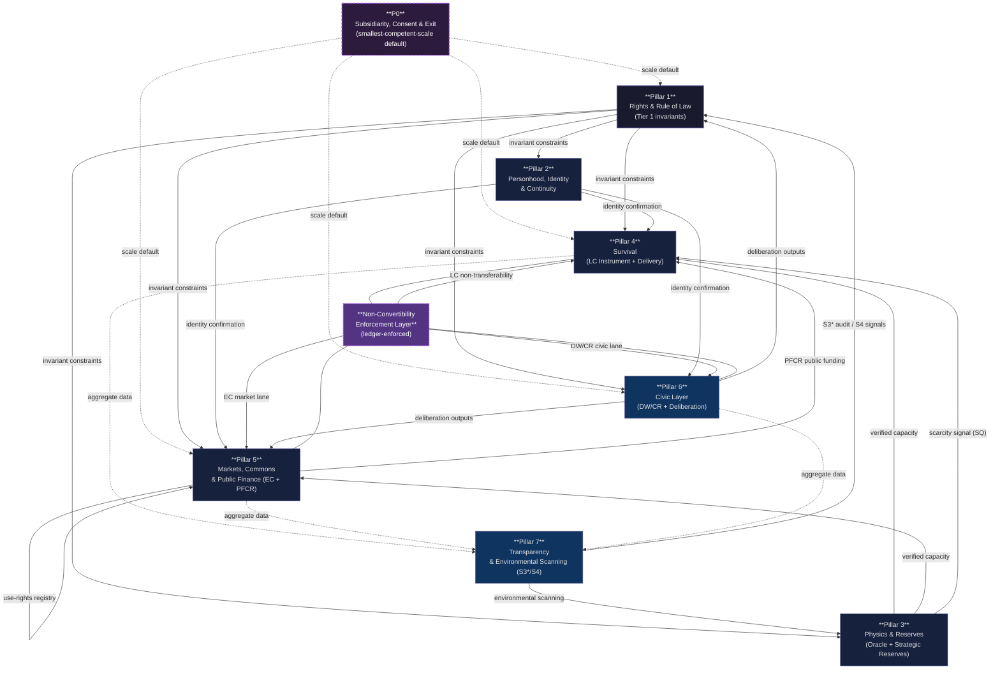

# The Twelve-Pillar Protocol

> A non-extractive civilizational operating system — separating survival, markets, and governance into structurally independent lanes.

## Contents

- [What this is](#what-this-is)
- [The core separation](#the-core-separation)
- [The seven pillars (on a subsidiarity foundation)](#the-seven-pillars-on-a-subsidiarity-foundation)
- [Pillar authority flow](#pillar-authority-flow)
- [Document set](#document-set)
- [Technical specifications](#technical-specifications)
- [Hardening history](#hardening-history)
- [Security and attack surface](#security-and-attack-surface)
- [What this system is not](#what-this-system-is-not)
- [What will go wrong](#what-will-go-wrong-pre-committed)
- [Scale readiness](#scale-readiness)
- [How to engage](#how-to-engage)
- [License](#license)

## What this is

The Twelve-Pillar Protocol is a constitutional systems design for a society in which **survival is unconditional**, **markets remain productive**, and **governance cannot be purchased**. It is built on a single core diagnosis: when survival, enterprise, and political influence all ride on the same money, wealth converts into coercion. Every major social system fails at this interface. This protocol is an attempt to escape that failure mode by design.

This is not a political manifesto. It is a systems engineering document — with threat modeling, adversarial red-teaming, patch logs, and version control. It has been stress-tested against bad actors, institutional capture, measurement failure, and its own internal contradictions.

## The core separation

The protocol separates three social functions that most systems collapse together:

| Instrument | Purpose | What it cannot do |
|---|---|---|
| **EC** — Enterprise Currency | Markets, wages, contracts, savings, investment | Buy survival access or civic power |
| **LC** — Life Access Ledger | Baseline essentials: food, shelter, healthcare, transit | Become cash, collateral, or a status marker |
| **DW / CR** — Civic Layer | Bounded agenda-setting and service eligibility | Gate dignity, purchase rights, or accumulate indefinitely |
| **SQ** — Scarcity Quotas | Emergency rationing during verified shortage | Become permanent or a hidden market |

The walls between these lanes are the system. Not the instruments themselves.

EC is public money rather than privately created bank money. It is primarily digital, secured with cryptographic methods, and paired with physical cash or equivalent offline instruments for resilience and privacy.

## The seven pillars (on a subsidiarity foundation)

> *Proposal 2 close-out (2026-04-18): the operational architecture was restructured from twelve pillars into **Seven Pillars on a P0 subsidiarity foundation** (v13). The project name "Twelve-Pillar Protocol" is retained for continuity of external reference. The v12 → v13 crosswalk lives in [`Master_Protocol.md`](./Master_Protocol.md) §III.*

Each pillar has one job. The architecture is intentionally modular so no single office, ledger, or emergency process can silently absorb the others. **Pillar 0** reads through every operational pillar: decisions default to the smallest competent scale, and federation-scale action requires affirmative justification.

0. **Subsidiarity, Consent & Exit (P0)** — Smallest-competent-scale default (household → neighborhood ≤500 → locality ≤5,000 → region ≤500,000 → federation); affirmative 2/3 consent to join; 2/3 exit supermajority with a 730-day graceful unwind preserving LC continuity; no exit tax, no forfeiture
1. **Rights & Rule of Law** — Tier 1 invariants (dignity, due process, non-coercion, separation-of-concerns) and rule-bound execution of those rights under a published discretion taxonomy
2. **Personhood, Identity & Continuity** — One-person continuity, recovery, guardianship, without surveillance
3. **Physics & Reserves** — Polycentric measurement of what society can actually deliver, paired with strategic resilience reserves (food, water, energy, medicines) that buffer measurement error and supply shocks
4. **Survival (LC Instrument + Delivery)** — The Life Access Ledger as instrument AND its delivery to people as actual access, under non-transferability and anti-coercion rules; the Constitutional Survival Minimum (Annex Y) is the floor
5. **Markets, Commons & Public Finance** — EC as the single general-purpose currency; housing/land as use-rights; enterprise under anti-monopoly constraints; the Public Finance & Commons Revenue (PFCR) function funding public operations through non-extractive structural revenue rather than taxes on survival or ordinary labor
6. **Civic Layer (DW/CR + Deliberation)** — DW and CR as non-monetary civic instruments; the contribution acts that mint them; the deliberation processes that consume them — one closed loop, with rotation, caps, and anti-capture weighting
7. **Transparency & Environmental Scanning** — Real-time aggregate dashboards (the audit channel, genuinely independent of Pillar 1 control) plus Beer-VSM S4 external-world scanning for emerging risks that could destabilize measurement assumptions or the survival floor

## Pillar authority flow

The diagram below shows how authority and enforcement relationships flow between the Seven Pillars on the P0 subsidiarity foundation. Arrows indicate dependency or oversight direction. The non-convertibility enforcement layer sits between all instrument lanes and is not controlled by any single pillar. P0 reads through every operational pillar: decisions default to the smallest competent scale.

**Reading the diagram:** **P0** (purple dashed, top) is the subsidiarity foundation — a read-through constraint rather than an operational lane; every pillar resolves to the smallest competent scale by default. **Pillar 1** (dark) constrains all operational pillars — it is the only pillar that cannot be amended by any in-system process. The **Non-Convertibility Enforcement Layer** (purple, dashed) is not a pillar; it is a ledger-level constraint that sits between the LC (P4), EC (P5), and DW/CR (P6) instrument lanes. No single pillar controls it. **Pillar 7**'s audit channel is genuinely independent of P1 control — this is the Beer-VSM S3/S3* split enforced structurally.

## Document set

### Core documents

| Document | Purpose |
|---|---|
| [`Master_Protocol.md`](./Master_Protocol.md) | Primary constitutional source of truth. Operative language, all annexes. |
| [`White_Paper.md`](./White_Paper.md) | Plain-language public explanation. Start here. |
| [`Threat_Register.md`](./Threat_Register.md) | Adversarial risk model. 27 threat IDs — 17 ADDRESSED, 5 PARTIAL, 4 OPEN (T-003 retired). T-017/P-014 is the FOUNDING instrument. |
| [`Patch_Log.md`](./Patch_Log.md) | Change and mitigation history. 30 patches — 15 ACTIVE, 15 PROPOSED (1 FOUNDING: P-014). |
| [`Acceptance_Protocol.md`](./Acceptance_Protocol.md) | Process for moving patches from design to operation. |
| [`Citizen_Facing_Rights_Layer.md`](./Citizen_Facing_Rights_Layer.md) | Plain-language summary of citizen rights and protections. |

### Technical specifications (`docs/`)

| Document | Purpose |
|---|---|
| [`docs/INVARIANTS.md`](./docs/INVARIANTS.md) | Seven constitutional invariants (INV-001 through INV-007). Tier 1 protected. Any patch that violates these is rejected at intake. |
| [`docs/SPECIFICATIONS.md`](./docs/SPECIFICATIONS.md) | Formal state machine definitions for EC, LC, DW/CR, and SQ. Demurrage function, issuance constraints, oracle consensus rules, parameter table. |
| [`docs/Adversarial_Narrative_Simulation.md`](./docs/Adversarial_Narrative_Simulation.md) | 10 simulated narrative attacks with structural responses and residual risks. |
| [`docs/Annual_Compound_Simulation.md`](./docs/Annual_Compound_Simulation.md) | Month-by-month operational year stress-test across all seven pillars on the P0 foundation (authored under v12 nomenclature; see v12→v13 crosswalk in `Master_Protocol.md` §III). |
| [`docs/P014_Preactivation_Disclosure.md`](./docs/P014_Preactivation_Disclosure.md) | Founding instrument pre-activation disclosure. |
| [`simulations/model_outline.py`](./simulations/model_outline.py) | Agent-based simulation scaffold (Mesa framework). Models LC vs. EC flow across citizen and adversarial agents. Four scenario runners: baseline, oracle stress, high demurrage, adversarial density. |

### Annexes (`docs/annexes/`)

Standalone annexes function as pre-launch blocking gates for specific patches. A patch cannot move to ACTIVE until its blocking annex is complete.

| Annex | Purpose | Blocks |
|---|---|---|
| [`docs/annexes/ANNEX_AI.md`](./docs/annexes/ANNEX_AI.md) | Ombuds Office constitution: mandate, independence requirements, manufactured-flag authority, meta-capture prevention. | P-015 |
| [`docs/annexes/ANNEX_AJ.md`](./docs/annexes/ANNEX_AJ.md) | Above-ledger bypass worked examples across all three instrument boundaries. | T-001 open problem |
| [`docs/annexes/ANNEX_AK.md`](./docs/annexes/ANNEX_AK.md) | Identity asymmetric error doctrine: fraud/exclusion rate targets, decision rule, recalibration process. | P-016 |
| [`docs/annexes/ANNEX_AL.md`](./docs/annexes/ANNEX_AL.md) | Methodology-class definitions for oracle independence: P-004 protected definitions, three canonical classes, anti-monoculture trigger, annual audit. | P-017 |
| [`docs/annexes/ANNEX_AR.md`](./docs/annexes/ANNEX_AR.md) | Contract-commitment architecture parameters: release thresholds, deployment windows, force majeure caps, inspector pool governance. | P-023 |
| [`docs/annexes/REGISTER_DISCLOSURE_PROTOCOL.md`](./docs/annexes/REGISTER_DISCLOSURE_PROTOCOL.md) | Annex AO — public/restricted bifurcation framework for the Threat Register. | P-021 |

## Security and attack surface

The three highest-severity failure modes, their mechanisms, and the algorithmic mitigations in place:

### 1. The Oracle Problem (T-020 / T-021) — Critical

**Mechanism:** The LC issuance system depends on oracle nodes measuring real-world physical capacity. Two nodes can satisfy every formal criterion for independence (separate institutions, separate funders, separate governance) while sharing the same epistemological foundation — the same statistical tradition, peer-review standards, and conception of valid evidence. When this happens, their errors are correlated: a coordinated actor who shifts the dominant methodology standard corrupts the measurement system without touching any data directly.

**Algorithmic mitigation (P-017 / Annex AL):**
- Minimum three oracle nodes required
- Nodes must differ on all three dimensions simultaneously: epistemological foundation, data generation process, and standards provenance
- At least one node must use direct physical sampling (ground-truth, Tier 3) — this node cannot share standards provenance with institutional statistical nodes
- Error independence test required: nodes must produce materially different error structures, not merely formally different methodologies
- Anti-monoculture trigger: if ≥3 nodes share a standards body, independent review is mandatory

**Residual risk:** The definition of "fundamentally different methodology" is itself a protected term (P-004 / Annex AL) — but whoever influences that definition retains indirect leverage. This is documented as an open residual risk, not a resolved problem.

---

### 2. Above-Ledger Bypass / Shadow Convertibility (T-001) — Critical

**Mechanism:** The non-convertibility constraint is enforced at the ledger layer. Off-ledger transactions — proxy LC redemption, service-for-LC exchanges, informal barter at instrument boundaries — are not preventable by ledger rules alone. A motivated actor can approximate LC-to-EC conversion without technically touching the ledger: pay someone in goods to redeem LC on their behalf, or build a service market that prices itself in LC-equivalent units.

**Algorithmic mitigation (P-001 / Annex AJ):**
- LC redemption is non-delegable: biometric or equivalent identity confirmation required at delivery point (Tier 2 assurance minimum)
- Cluster anomaly detection: statistical monitoring for redemption patterns inconsistent with individual use
- Broker signature detection: behavioral patterns characteristic of proxy-redemption networks flagged for Ombuds review
- LC-only essential access: certain essential services only accessible via LC redemption, not EC purchase — reduces the conversion incentive by narrowing what EC can buy in the survival lane

**Residual risk:** Detection depends on statistical anomaly thresholds. A sufficiently distributed, low-frequency proxy network may fall below detection bounds. Explicit leakage tolerance accepted in P-001; T-001 remains PARTIAL status.

---

### 3. Electoral Cycle Capture / Hostile Successor Government (T-022) — Critical

**Mechanism:** A hostile successor government can legally dismantle the constitutional architecture through legitimate processes: refusing to fund LC delivery infrastructure, appointing non-compliant oracle administrators, passing legislation that redefines protected terms below the constitutional amendment threshold, or simply allowing administrative hollowing — the system remains on paper while operational capacity is systematically defunded.

**Algorithmic mitigation (P-018):**
- Entrenchment ladder: LC floor provisions require progressively higher supermajorities to amend as time-in-operation increases
- LC floor minimum persistence: no successor government may reduce LC below CSM in fewer than N legislative cycles [FOUNDING COMMITMENT: N]
- Administrative hollowing triggers: defined operational metrics (delivery throughput, oracle response time, enforcement rate) that, when breached, automatically activate the Pre-Confirmation Response Protocol (PCRP) regardless of political direction
- Transition protocol: mandatory handoff documentation, independent audit of operational capacity, and public status report required before any change-of-government that affects Pillar 4 or Pillar 10 operations

**Residual risk:** The entrenchment ladder and persistence requirements are only as durable as the constitutional text that contains them. A sufficiently determined successor government with a large enough legislative majority can repeal the constitutional text itself. This is the recursion of T-017 (bootstrap problem) — resolved founding legitimacy does not prevent future delegitimation.

## Hardening history

The system has been adversarially stress-tested:

| Threats addressed | Key findings |
|---|---|
| T-001 Shadow Convertibility, T-002 Identity Exploits, T-004 Incentive Collapse, T-007 Definition Drift | Four patches now ACTIVE |
| T-005 Governance Throughput, T-006 Measurement Lag, T-008 Bureaucratic Elite Formation, T-011 Narrative Surface | Dual-queue CRP, PCRP first-responder authority, diversity controls, failure doctrine |
| T-012–T-015 (Interface threats) | Compound tests revealed triple-deadlock risk; oracle independence requirement; demand-context flag |
| T-009 Grace Exploitation Loop | Graduated renewal intensity; CR slow-decay; hardship attestation collusion detection |
| T-016 Formal Acceptance Process Capture | Evidence farming, sign-off deadlock, urgency exploit, audit capture all patched |
| T-017 Bootstrap Problem | One-time founding instrument (P-014) resolves P-013 circular dependency; founding window extended to 60 days |
| T-018–T-019 PCRP Attack Surface | False-trigger exhaustion and demand-context suppression attacks registered and patched (P-015) |
| T-020–T-021 Oracle Independence | Epistemological and algorithmic oracle capture registered; methodology-class diversity and AI supply-chain transparency required (P-017) |
| T-022 Electoral Cycle Capture | Hostile successor government routes identified; entrenchment ladder, LC floor persistence, transition protocol designed (P-018) |
| T-023–T-025 Pilot validity, SQ oracle failure, demurrage capture | External validity gate (P-019), SQ oracle-failure fallback (P-022), demurrage sector-capture resolved: contract-commitment architecture, zero exemptions (P-023) |

**Current status: 15 patches ACTIVE, 15 PROPOSED (1 FOUNDING instrument: P-014), 4 threat IDs OPEN, 5 PARTIAL, 17 ADDRESSED.** 30 patches total across 27 threat IDs. The design continues to harden. What remains is pilot evidence and patch acceptance.

## What this system is not

| Common fear | Protocol response |
|---|---|
| A hidden social credit system | DW/CR cannot buy rights, goods, immunity, or survival access. Human worth is never measured. |
| A command economy | EC still runs markets, pricing, contracts, enterprise, and innovation. The protocol constrains power, not trade. |
| A welfare bureaucracy | LC is grounded in measured physical capacity, clear basket rules, and reviewable scarcity procedures. |
| A surveillance state | Identity and dashboards use minimum necessary data, aggregation thresholds, and selective disclosure. |
| A rentier loophole | Land and housing are use-rights with anti-vacancy rules, not speculative ownership. |

## What will go wrong (pre-committed)

The system acknowledges expected operational imperfections before they occur:

- **PCRP false triggers** — will happen; detection, termination, and public post-mortem within 7 days are the designed response
- **Oracle disputes** — will happen; conservative defaults protect access while disputes resolve
- **SQ scarcity activations** — will happen during genuine shortage; managed rationing instead of price-spike exclusion
- **Enforcement errors** — will happen; partitioned wallets and due process are the correction mechanism
- **Measurement uncertainty** — is permanent; published confidence bands are the honest response

The system's commitment: every failure in these categories is published publicly, with a timeline and a correction path. Silence is the violation, not the failure.

## Scale readiness

The system is **defensible and documented**. It is not yet **scale-ready**. Scale readiness requires:

- [ ] Formal acceptance of PROPOSED patches (pilot evidence required)
- [x] CFRL one-page publication — see [`Citizen_Facing_Rights_Layer.md`](./Citizen_Facing_Rights_Layer.md)
- [x] Adversarial narrative simulation — see [`docs/Adversarial_Narrative_Simulation.md`](./docs/Adversarial_Narrative_Simulation.md)
- [x] Annual compound simulation — see [`docs/Annual_Compound_Simulation.md`](./docs/Annual_Compound_Simulation.md)
- [ ] Legitimate founding coalition

The Formal Acceptance Protocol defines the pathway from design to operation.

## How to engage

**Read the White Paper first.** It is 14 pages and written for a general audience.

**Then the Threat Register** if you want to stress-test the design — it documents every adversarial failure mode and mitigation.

**Then the Master Protocol** if you want the operative language.

**To critique, challenge, or contribute:** open an Issue with your specific objection, the section it applies to, and your proposed alternative. Vague objections will be asked to specify. Specific objections will be taken seriously.

**To cite this work:** see `CITATION.cff` in this repository.

## License

This work is released under [Creative Commons Attribution 4.0 International (CC BY 4.0)](https://creativecommons.org/licenses/by/4.0/). You may share, adapt, and build on it for any purpose, including commercial, as long as you give appropriate credit.

---

*The protocol is not a utopia machine. It is an attempt to build a civic operating system whose own powers are constrained tightly enough to make its promises believable.*
